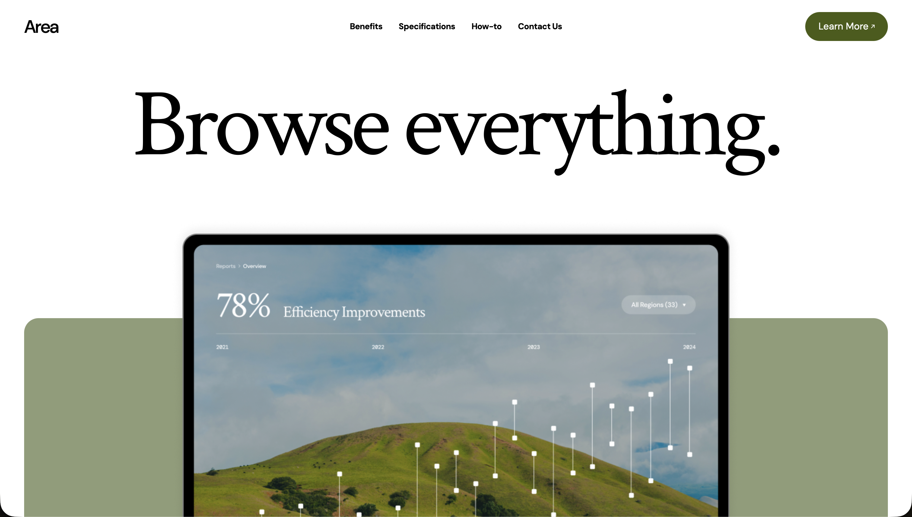

### `README_RU.md` (RU)

# Area Landing Page

**Area** is a modern, responsive landing page built with React, TypeScript and Vite.  The goal of this pet project is to practise component composition, animation and layout techniques by recreating a marketing page for a fictional analytics platform.  The page showcases interactive sections, smooth scrolling navigation, parallax effects and responsive design.  While it is inspired by a commercial product, this repository exists for educational purposes and is not affiliated with any real company.

Link to [Github pages](https://sunsetteq.github.io/area-landing-page/)

## Table of contents
- [Overview](#overview)
- [Features](#features)
- [Screenshots](#screenshots)
- [Tech stack](#tech-stack)
- [Getting started](#getting-started)
- [Project structure](#project-structure)

## Overview
The application consists of a single **MainPage** broken down into smaller widgets (header, benefits, specifications, how‑to, contact) following a feature‑sliced design.  Content for each section is defined in configuration files rather than being hard‑coded in components.  Navigation links jump between the sections using anchor IDs and remain fixed on larger screens.  Animations are implemented with **Framer Motion**, and styling is handled by **Tailwind CSS**.  Module resolution uses custom aliases configured in `vite.config.ts` to keep imports clean, for example `@app` for the root application layer and `@ui` for reusable UI primitives

This landing page design was inspired by the freely available Modern Product Launch template from the Figma Community.  The goal of this project is to recreate that template’s look and feel while practising modern front‑end development.  You can see the original design here: [Modern Product Launch on Figma](https://www.figma.com/community/file/1487309170684591074/modern-product-launch)

## Features
- **Smooth scrolling navigation** — a fixed navigation bar on desktop scrolls to each section using hash links.  On smaller screens, navigation collapses into a burger menu and scrolls with the page.
- **Responsive design & animations** — layouts adapt across mobile, tablet and desktop breakpoints.  Components fade into view or slide as the user scrolls, thanks to framer‑motion.  Similar projects use the same libraries to achieve interactive animations and responsive design.
- **Type safety** — the project uses TypeScript to catch errors at compile time and improve the development experience.

## Screenshots

| Desktop | Tablet | Mobile |
|---|---|--- |
|  | |  |

## Tech stack
The project leverages modern front‑end tools and libraries:

| Tool | Purpose |
|---|---|
| **React 19** | Component library for building the user interface |
| **TypeScript** | Provides static typing for safer development |
| **Vite** | Lightning‑fast bundler and dev server |
| **Tailwind CSS** | Utility‑first CSS framework for rapid styling |
| **Framer Motion** | Declarative animation library for React |
| **ESLint & Prettier** | Code linting and formatting |
| **vite-plugin-svgr** | Enables importing SVGs as React components |
| **Docker** | Multi‑stage build uses a Node 20‑alpine image to compile the app and an Nginx 1.27‑alpine image to serve the static files |

Aliases defined in the Vite config allow neat, relative‑free imports, such as @app → src/app, @pages → src/pages, @widgets → src/widgets and more 

## Getting started

```bash
git clone https://github.com/SunsetTeq/Modern_Site_Page.git
cd Modern_Site_Page

# установка
npm install
# или
yarn install

# запуск dev
npm run dev
# или
yarn dev
```
## Running with Docker
```bash
# build the image (will be tagged as area-landing)
docker build -t area-landing .

# run the container on port 8080
docker run -p 8080:80 area-landing
```
Visit http://localhost:8080 in your browser to view the site.  The Nginx configuration caches static assets and falls back to index.html for all routes, making it suitable for single‑page applications

## Project structure
The project follows a feature‑sliced architecture.  Major folders and their purpose include:
| Directory | Description |
|---|---|
| **src/app** | Sets up global providers such as styles and defines the root component |
| **src/pages** | Top‑level routes; currently contains MainPage which composes all sections |
| **src/widgets** | Larger UI blocks (navigation bar, hero section, benefit cards, specification table, etc.) |
| **src/shared** | Shared resources: assets, configuration, hooks, UI primitives and utility functions |
| **src/shared/config/constants** | Contains arrays and objects that hold content for the page |
| **src/shared/assets** | Images and icons used throughout the site, including screenshot assets for the README |

The Vite alias configuration maps these folders to short prefixes, making imports cleaner
