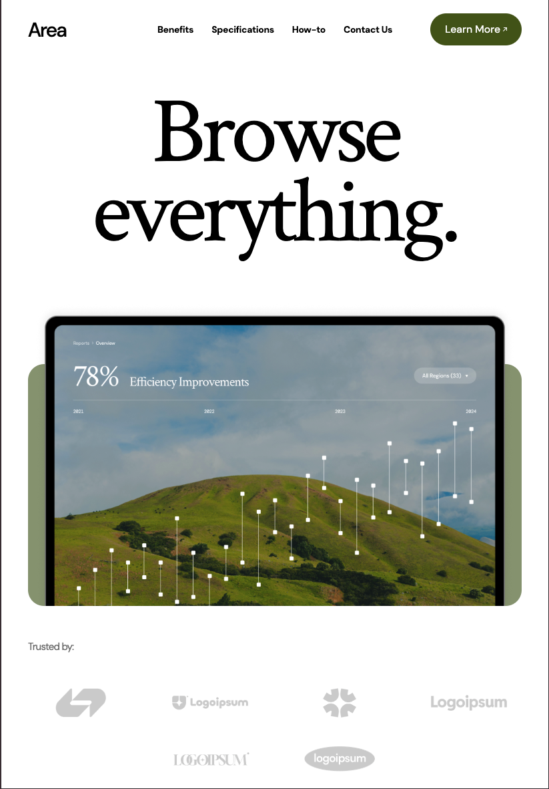

### `README_RU.md` (RU)

# Area Landing Page

**Area** — это современная адаптивная лендинг‑страница, написанная на React, TypeScript и Vite.  Этот проект создан для отработки навыков компоновки, анимации, верстки по макету для вымышленной аналитической платформы.  Страница демонстрирует интерактивные блоки, плавную навигацию по якорям, параллакс‑эффекты и адаптивную вёрстку.  Проект носит учебный характер и не связан с какой‑либо реальной компанией.

Дизайн основан на бесплатном шаблоне **Modern Product Launch** из сообщества Figma. Цель — воспроизвести внешний вид/структуру шаблона и прокачать скиллы фронтенда. Макет: https://www.figma.com/community/file/1487309170684591074/modern-product-launch

## Содержание
- [Обзор](#обзор)
- [Функции](#функции)
- [Скриншоты](#скриншоты)
- [Стек технологий](#стек-технологий)
- [Начало работы](#начало-работы)
- [Запуск через Docker](#запуск-через-docker)
- [Структура проекта](#структура-проекта)

## Обзор
Одна страница **MainPage**, собранная из виджетов (хедер, преимущества, спецификации, «как начать», контакты) по мотивам feature-sliced подхода. Контент лежит в конфигурационных файлах. Навигация по якорям с фиксированным меню на десктопе. Анимации — **Framer Motion**, стили — **Tailwind CSS**. В `vite.config.ts` настроены алиасы (`@app`, `@pages`, `@widgets`, `@ui`) для удобных импортов.

## Функции
- **Плавная навигация** — фиксированное меню на десктопе и бургер‑меню на мобильных устройствах прокручивают страницу к разделам.
- **Адаптивность и анимации** — блоки подстраиваются под размеры экрана, а элементы появляются плавно благодаря framer‑motion.  Подобные проекты часто используют эти библиотеки для реализации интерактивных анимаций и адаптивной вёрстки.
- **Статическая типизация** — TypeScript помогает ловить ошибки на этапе компиляции и улучшает DX.

## Скриншоты

| Десктоп |Планшет | Мобильный |
|---|---|--- |
|  | |  |

## Стек технологий

| Инструмент | Назначение |
|---|---|
| **React 19** | Библиотека компонентов для построения интерфейсов |
| **TypeScript** | Статическая типизация |
| **Vite** | Дев-сервер и сборщик |
| **Tailwind CSS** | Утилитарные стили |
| **Framer Motion** | Анимации для React |
| **ESLint & Prettier** | Линтинг и форматирование |
| **vite-plugin-svgr** | SVG как React-компоненты |
| **Docker** | Многостадийная сборка (Node 20-alpine → Nginx 1.27-alpine) |

## Начало работы

```bash
git clone https://github.com/SunsetTeq/Modern_Site_Page.git
cd Modern_Site_Page

# установка
npm install
# или
yarn install

# запуск dev
npm run dev
# или
yarn dev
```
## Запуск через Docker
```bash
# собрать образ
docker build -t area-landing .

# запустить контейнер на порту 8080
docker run -p 8080:80 area-landing
```
## Структура проекта
Проект организован по принципам Feature-Sliced Design.  Основные каталоги:
| Каталог | Назначение |
|---|---|
| **src/app** | Настройка глобальных провайдеров и корневой компонент |
| **src/pages** | Верхнеуровневые страницы |
| **src/widgets** | Крупные UI‑блоки (навигация, подвал) |
| **src/shared** | Общие ресурсы: ассеты, конфигурации, хуки, утилиты и UI‑примитивы |
| **src/shared/config/constants** | Конфигурации с данными для страницы |
| **src/shared/assets** | Изображения и иконки, в том числе скриншоты для README |
